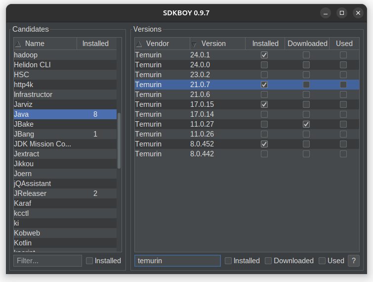

= SDKBOY image:https://img.shields.io/badge/License-GNU%20GPL-blue[link="https://www.gnu.org/licenses/gpl-3.0.en.html"]

A Cross-Platform Java Swing based https://sdkman.io[SDKMAN] Desktop App.

Uses the `sdkman-api` module from https://github.com/jagodevreede/sdkman-ui[jagodevreede/sdkman-ui] and would not exist without it.

Developed using the `codion-common-swing-ui` module of the https://github.com/codion-is/codion[Codion Application Framework].

Look & Feel provided by https://github.com/JFormDesigner/FlatLaf[Flat Look & Feel].

NOTE: `SDKBOY` is a keyboard centric application. You can certainly get by mousing around, but the key to success is `Alt-S` which toggles the keyboard shortcut overview.

NOTE: Use `Alt-P` to open **Preferences** and the arrow keys to browse for a Look & Feel fitting the mood.

https://sdkman.io[SDKMAN] must be installed on the system.

Run the application.
[source,shell]
----
gradlew run
----

Build a jlink image to `build/sdkboy`

[source,shell]
----
gradlew jlink
----

Build a zipped jlink image to `build/sdkboy.zip`

[source,shell]
----
gradlew jlinkZip
----

Build the default native installer(s) to `build/jpackage`

[source,shell]
----
gradlew jpackage
----

== Inspiration

Original idea and UI design from https://github.com/jagodevreede/sdkman-ui[SDKman UI] by https://github.com/jagodevreede[Jago de Vreede].

**JavaOne** presentation: https://www.youtube.com/watch?v=qUoUG8wRTDQ[Building a Multiplatform SDKMAN in JavaFX].

Figured I would try to do the same using Swing, replacing the native Graal executable with a standard jlink image for simplicity.